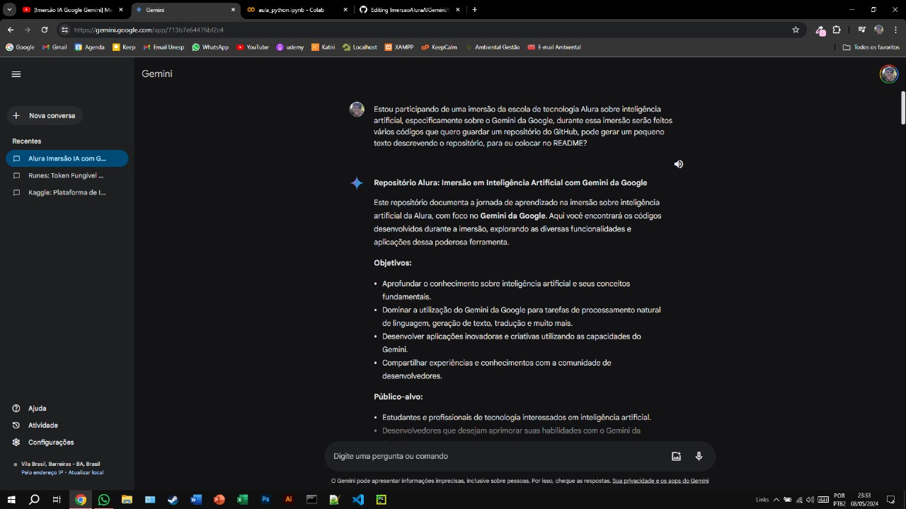
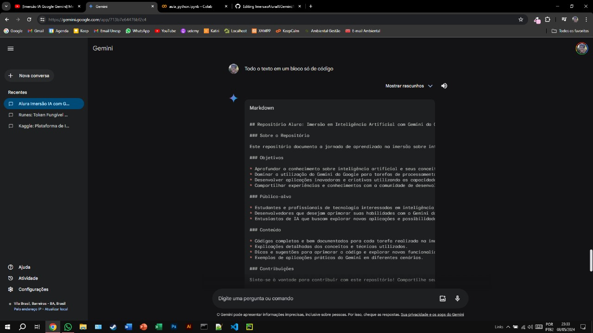

# Imersão IA Google Gemini - Alura
> Compilado de códigos e arquivos utilizados durante a imersão

Este repositório documenta a jornada de aprendizado na imersão sobre inteligência artificial da Alura, com foco no **Gemini da Google**. Aqui você encontrará os códigos desenvolvidos durante a imersão, explorando as diversas funcionalidades e aplicações dessa poderosa ferramenta.

### Objetivos

* Aprofundar o conhecimento sobre inteligência artificial e seus conceitos fundamentais.
* Dominar a utilização do Gemini da Google para tarefas de processamento natural de linguagem, geração de texto, tradução e muito mais.
* Desenvolver aplicações inovadoras e criativas utilizando as capacidades do Gemini.
* Compartilhar experiências e conhecimentos com a comunidade de desenvolvedores.

### Público-alvo

* Estudantes e profissionais de tecnologia interessados em inteligência artificial.
* Desenvolvedores que desejam aprimorar suas habilidades com o Gemini da Google.
* Entusiastas de IA que buscam explorar novas aplicações e possibilidades.

### Conteúdo

* Códigos completos e bem documentados para cada tarefa realizada na imersão.
* Explicações detalhadas dos conceitos e técnicas utilizados.
* Dicas e sugestões para aprimorar o código e explorar novas funcionalidades.
* Exemplos de aplicações práticas do Gemini em diferentes cenários.

### Tecnologias utilizadas

* Gemini da Google
* Python
* Google Colab

### Observações

* Este repositório está em constante evolução, à medida que novos conhecimentos e experiências são adquiridos.
* O texto desse README foi gerado com a ajuda do Gemini:

